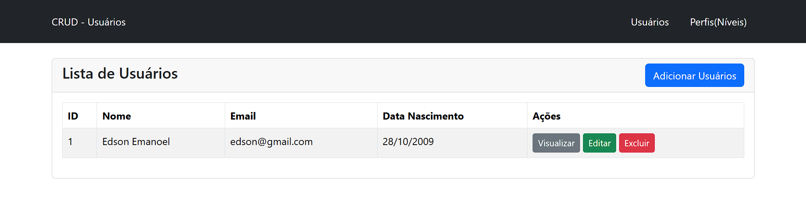
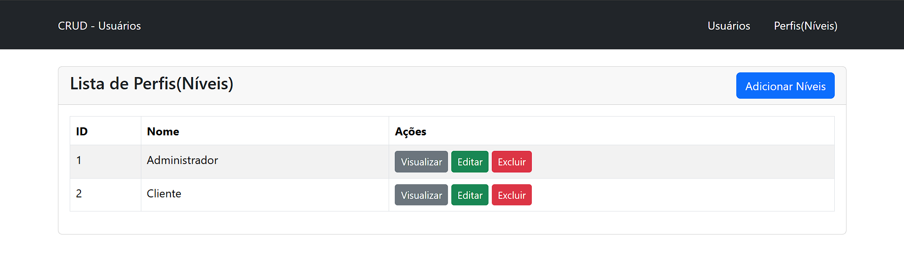

# Por que 

* Praticar CRUD com PHP e MySQL

## Como ficaram as telas:

- Tela de Listagem de Usuários:

- Tela de Listagem de Perfis(Níveis de Acesso):

## Ref.
(Link do Vídeo)["https://www.youtube.com/watch?v=aIQXgNmx_ug"]